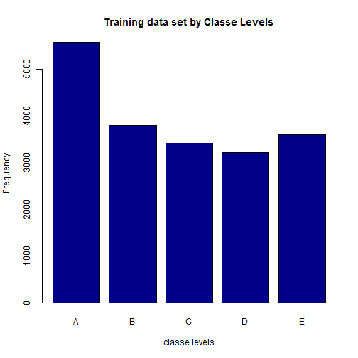
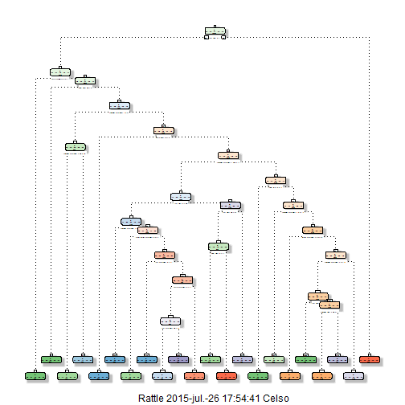
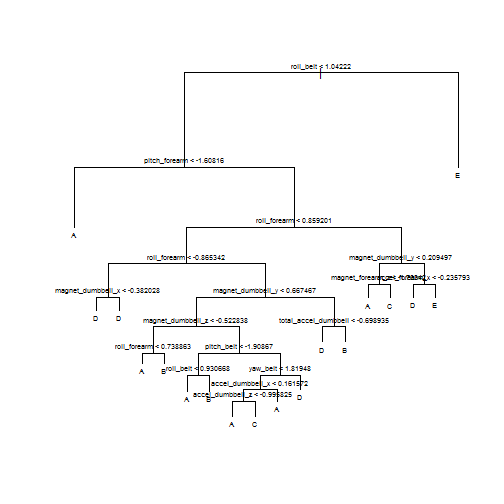
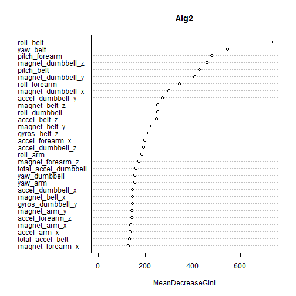

#OBJECTIVE
Create a report that explains how a model to predict the manner in which a subject  do its excersicse is built, showing how the cross validation mas made and what are the assumptions established.

The training data for this project IS available here: https://d396qusza40orc.cloudfront.net/predmachlearn/pml-training.csv and the test data: https://d396qusza40orc.cloudfront.net/predmachlearn/pml-testing.csv

The data for this project come from this source: [http://groupware.les.inf.puc-rio.br/har]. The next paragrap is extracted from the document.

"Participants were asked to perform one set of 10 repetitions of the Unilateral Dumbbell Biceps Curl in 5 different fashions:
* Exactly according to the specification (Class A)
* Throwing the elbows to the front (Class B)
* Lifting the dumbbell only halfway (Class C)
* Lowering the dumbbell only halfway (Class D)
* throwing the hips to the front (Class E)

Class A corresponds to the specified execution of the exercise, while the other 4 classes correspond to common mistakes." 

The goal is to buil a prediction model based on minimizing the out fo sample error with the best possible accuracy. Two models are tested using random forest algorithms. **The previous categories will be used.**

#DATASET
The dataset contains 19,622 observations and 160 variables describing characteristics useful to predict the form in which 6 subjects made a barber lift. There is just one way to do this correctly and four categories for ech type of commomn mistake.

The dataset needs to be cleaned because there are variables that are not useful to build the prediction model, more important, they can distorsionate the result.

First, after reading the data the variables that contains missing values will be eliminated from the sample.Then it is going to be analized if there are variables with unique or few values (near zero predictors.)


```r
set.seed(1890)
TrainUrl <- "http://d396qusza40orc.cloudfront.net/predmachlearn/pml-training.csv"
TestUrl <- "http://d396qusza40orc.cloudfront.net/predmachlearn/pml-testing.csv"
traindata<- fread(TrainUrl)
testdata <- fread(TestUrl)

Nas <- sapply(testdata, function (x) any(is.na(x) | x == ""))
isPredictor <- !Nas & grepl("belt|[^(fore)]arm|dumbbell|forearm", names(Nas))
varnona <- names(Nas)[isPredictor]
predvar<-c("classe",varnona)

traindata<-traindata[,predvar,with=FALSE]
traindata[,.N,classe] #show elemens by factor
```

```
##    classe    N
## 1:      A 5580
## 2:      B 3797
## 3:      C 3422
## 4:      D 3216
## 5:      E 3607
```

```r
plot(as.factor(traindata$classe),col="blue4", main="Training data set by Classe Levels", xlab="classe levels", ylab="Frequency")
```



#SIZE TRAIN AND TEST SETS
Once the data is clean the sizes for the training and testing sets are set being 60% and 40& respectively.

the values of the predictors are centered and scaled with the objective of ensure that the criterion for choosing successive factors is based on how much variation they explain (same units).


```r
trainpart <- createDataPartition(traindata$classe, p=0.6)
trainpredict <- traindata[trainpart[[1]]]
testpredict <- traindata[-trainpart[[1]] ]

vars <- trainpredict[, varnona, with=FALSE]
preProc <- preProcess(vars)
preProc
```

```
## 
## Call:
## preProcess.default(x = vars)
## 
## Created from 11776 samples and 52 variables
## Pre-processing: centered, scaled
```

```r
censcalvars <- predict(preProc, vars)
csdatatrain <- data.table(data.frame(classe = trainpredict[, classe], censcalvars ))

vars <- testpredict[, varnona, with=FALSE]
censcalvars <- predict(preProc, vars)
csdatatest <- data.table(data.frame(classe = testpredict[, classe], censcalvars ))
```

To test wich algorithm is best (Decision Three or Random Forest) their prediction accuracy is calculated. This is the mechanism to prove **cross-validation**.


```r
Alg1 <- rpart(classe ~ ., data=csdatatrain, method="class")
fancyRpartPlot(Alg1)
```

```
## Warning: labs do not fit even at cex 0.15, there may be some overplotting
```



```r
Alg1pred <- predict(Alg1, csdatatest, type = "class")
confusionMatrix(Alg1pred, csdatatest$classe)
```

```
## Confusion Matrix and Statistics
## 
##           Reference
## Prediction    A    B    C    D    E
##          A 2039  296   69   74   60
##          B   42  892   80   73   93
##          C   14  106  944  184  111
##          D  103  180  263  922  237
##          E   34   44   12   33  941
## 
## Overall Statistics
##                                           
##                Accuracy : 0.7313          
##                  95% CI : (0.7214, 0.7411)
##     No Information Rate : 0.2845          
##     P-Value [Acc > NIR] : < 2.2e-16       
##                                           
##                   Kappa : 0.6591          
##  Mcnemar's Test P-Value : < 2.2e-16       
## 
## Statistics by Class:
## 
##                      Class: A Class: B Class: C Class: D Class: E
## Sensitivity            0.9135   0.5876   0.6901   0.7170   0.6526
## Specificity            0.9111   0.9545   0.9359   0.8806   0.9808
## Pos Pred Value         0.8034   0.7559   0.6946   0.5408   0.8844
## Neg Pred Value         0.9636   0.9061   0.9346   0.9407   0.9261
## Prevalence             0.2845   0.1935   0.1744   0.1639   0.1838
## Detection Rate         0.2599   0.1137   0.1203   0.1175   0.1199
## Detection Prevalence   0.3235   0.1504   0.1732   0.2173   0.1356
## Balanced Accuracy      0.9123   0.7711   0.8130   0.7988   0.8167
```

```r
tree.training=tree(classe~.,data=csdatatrain)
plot(tree.training, main="Classification Tree")
text(tree.training,pretty=1, cex =.6)
```



```r
Alg2<-randomForest(classe~., data = csdatatrain)
Alg2pred <- predict(Alg2, csdatatest, type = "class")
confusionMatrix(Alg2pred, csdatatest$classe)
```

```
## Confusion Matrix and Statistics
## 
##           Reference
## Prediction    A    B    C    D    E
##          A 2230    9    0    0    0
##          B    2 1502    9    0    0
##          C    0    7 1354   20    1
##          D    0    0    5 1265    5
##          E    0    0    0    1 1436
## 
## Overall Statistics
##                                           
##                Accuracy : 0.9925          
##                  95% CI : (0.9903, 0.9943)
##     No Information Rate : 0.2845          
##     P-Value [Acc > NIR] : < 2.2e-16       
##                                           
##                   Kappa : 0.9905          
##  Mcnemar's Test P-Value : NA              
## 
## Statistics by Class:
## 
##                      Class: A Class: B Class: C Class: D Class: E
## Sensitivity            0.9991   0.9895   0.9898   0.9837   0.9958
## Specificity            0.9984   0.9983   0.9957   0.9985   0.9998
## Pos Pred Value         0.9960   0.9927   0.9797   0.9922   0.9993
## Neg Pred Value         0.9996   0.9975   0.9978   0.9968   0.9991
## Prevalence             0.2845   0.1935   0.1744   0.1639   0.1838
## Detection Rate         0.2842   0.1914   0.1726   0.1612   0.1830
## Detection Prevalence   0.2854   0.1928   0.1761   0.1625   0.1832
## Balanced Accuracy      0.9988   0.9939   0.9927   0.9911   0.9978
```

```r
varImpPlot(Alg2,)
```



The randomForest prediction model is selected because it have an **accuracy** of **98.57%** over the **71.77%** of the Decision Three.

The **expected out-of-sample error** for this model is **1.43%.**

Using the test data the predictions are calculated

```r
Predictions<-predict(Alg2, testdata, type = "class")
```
#REFERENCES
[1] Velloso, E.; Bulling, A.; Gellersen, H.; Ugulino, W.; Fuks, H. Qualitative Activity Recognition of Weight Lifting Exercises. Proceedings of 4th International Conference in Cooperation with SIGCHI (Augmented Human '13) . Stuttgart, Germany: ACM SIGCHI, 2013.
